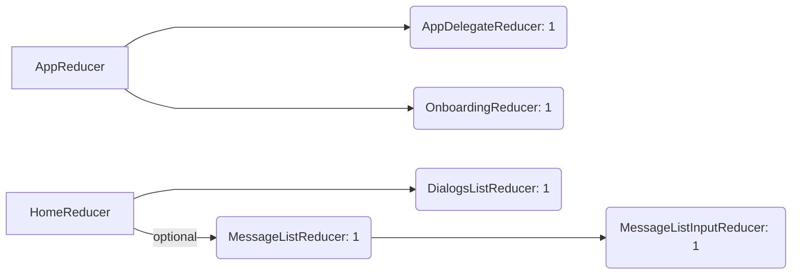

# FoundationModelsChat

A modern, local **AI chat application** built with **SwiftUI**, **Swift Concurrency**, and **The Composable Architecture (TCA)**, leveraging **Apple Foundation Models** for efficient local LLM interactions on **macOS** and **iOS**.

https://github.com/user-attachments/assets/9d37e013-a6b9-40cd-ba5a-f3d6036e5eb9

---

## 🚀 Features

✅ **Local LLM Chat** using Apple Foundation Models  
✅ **Streaming responses** with smooth TCA-based state management  
✅ **Adaptive, Apple Intelligence-inspired UI** with dynamic gradients and glass effects  
✅ **Structured local database** with `sharing-grdb` for chat history  
✅ **Cross-platform macOS and iOS support** with efficient window management  
✅ **Minimal, clear architecture optimized for extension and experimentation**  

---

## 🧩 Architecture

The project utilizes **The Composable Architecture (TCA)** for clear, testable, and modular state management. The following diagram illustrates the current reducer structure:

